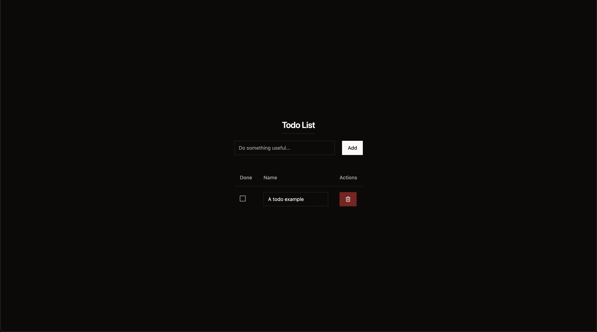

# Todo App
A simple todo app built with React and TypeScript. This project is a part of my learning journey with React and TypeScript.



## Tech Stack
- React
- TypeScript
- Tailwind CSS
- Vite

## How to use
1. Clone the repo
``` bash
git clone https://github.com/HajimeGit/SimpleTodoApp.git
```

2. Install dependencies
``` bash
npm install
```

3. Start the dev server
``` bash
npm run dev
```

## Contributing
Pull requests are welcome. For major changes, please open an issue first to discuss what you would like to change.

  